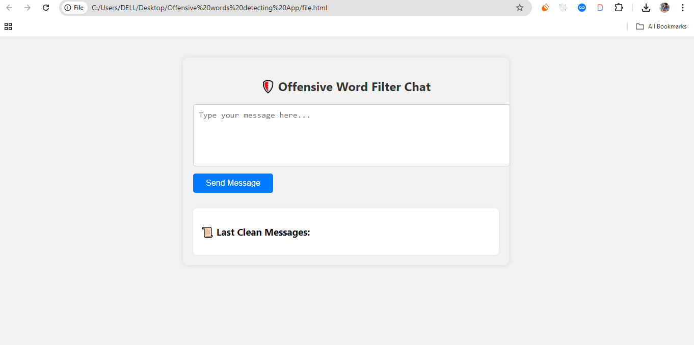

# 🛡️ Offensive Word Filter App

A lightweight, fully local web application that filters offensive or inappropriate words from user input in real-time. Built using **HTML**, **CSS**, and **JavaScript**, this project demonstrates front-end text moderation without relying on any external libraries or back-end services.

## 🚀 Features

- 🔎 **Real-time Filtering**: Censors offensive words instantly as users type.
- 🧠 **Custom Word List**: Easily modify the filter list in the JavaScript file.
- 💬 **Dynamic Censorship**: Offensive words are replaced with asterisks or symbols.
- 🎨 **Responsive UI**: Styled using pure CSS with responsive layout (Flexbox/Grid).
- 🔌 **Runs Locally**: No server, API, or internet connection required.

## 🛠️ Tech Stack

🔤 **HTML5** – UI structure 🎨 **CSS3** – Responsive styling 🧠 **JavaScript (ES6)** – Offensive word filtering logic

## 📂 Project Structure
/offensive-word-filter
├── index.html
├── style.css
├── script.js
└── README.md

## 📸 Screenshot

 
 
 
<!-- Replace with your actual image file name and path -->

## 🔧 How to Run Locally

1. **Clone the Repository**
   ```bash
   git clone https://github.com/UsamaSafder/offensive-word-filter.git
   
2  go to : cd offensive-word-filter

3. Open index.html in your browser

🎯 Learning Objectives
Learn how to build a basic text-moderation system using JavaScript.

Practice DOM manipulation, string handling, and real-time interaction.

Develop a responsive interface without any frameworks or libraries.
